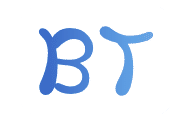

<p align="center">
    
</p>
<p align="center">
    <a href="https://www.npmjs.com/package/bt-ui">
        
    </a>
    <a href="https://www.npmjs.com/package/bt-ui">
        
    </a>
    <a href="LICENSE">
        
    </a>
</p>

# bt-ui
vue components build with vue
## api
[演示文档](http://frontman.cn/bt-ui)

## install
```shell
npm install bt-ui -S
```
## quickstart
``` javascript

import Vue from 'vue'
import btui from 'bt-ui'

Vue.use(btui)

// or
import {
  Select,
  Button
  // ...
} from 'bt-ui'

Vue.component(Select.name, Select)
Vue.component(Button.name, Button)

```
## Browser Support
chrome、firefox、暂不支持IE。

## Changelog
查看详细的[更新日志](https://github.com/ouyangshikang/bt-ui/blob/master/examples/docs/changelog.md)

## LICENSE
MIT


